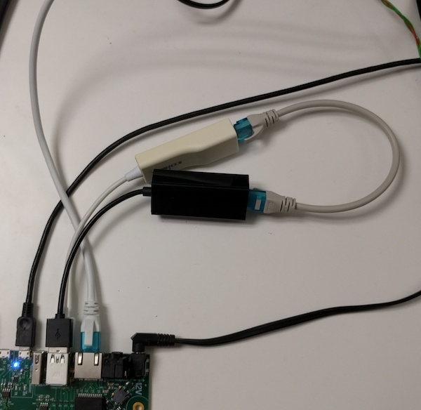

Stress-test tool to detect reordering by pfifo_fast.

More info in this thread: https://www.spinics.net/lists/netdev/msg488933.html



Example output:
```
root@rk3399-q7:~# ./pfifo_stress.py
expected ctr 0x1, received 0x1ad
expected ctr 0x257, received 0x258
expected ctr 0x259, received 0x257
expected ctr 0x258, received 0x259
expected ctr 0x279, received 0x27a
expected ctr 0x27b, received 0x279
expected ctr 0x27a, received 0x27b
expected ctr 0x588, received 0x589
expected ctr 0x58a, received 0x588
expected ctr 0x589, received 0x58a
expected ctr 0xb01, received 0xb02
expected ctr 0xb03, received 0xb01
expected ctr 0xb02, received 0xb03
expected ctr 0xcdc, received 0xcdd
expected ctr 0xcde, received 0xcdc
expected ctr 0xcdd, received 0xcde
expected ctr 0xe3c, received 0xe3d
expected ctr 0xe3e, received 0xe3c
expected ctr 0xe3d, received 0xe3e
expected ctr 0x1097, received 0x1098
expected ctr 0x1099, received 0x1097
expected ctr 0x1098, received 0x1099
expected ctr 0x17c0, received 0x17c1
expected ctr 0x17c2, received 0x17c0
expected ctr 0x17c1, received 0x17c2
expected ctr 0x17f5, received 0x17f6
expected ctr 0x17f7, received 0x17f5
```
